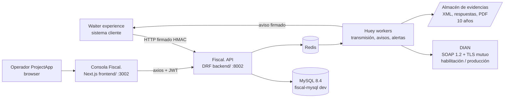
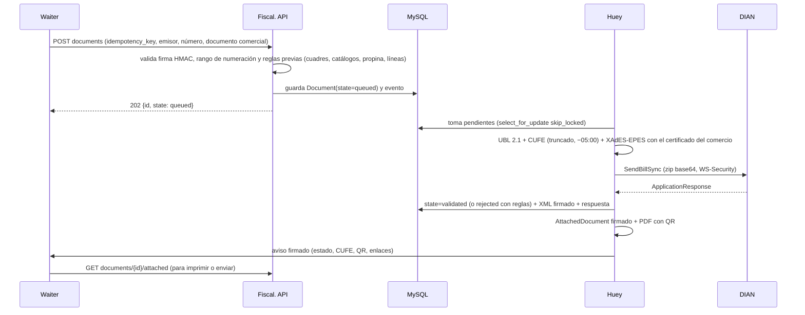
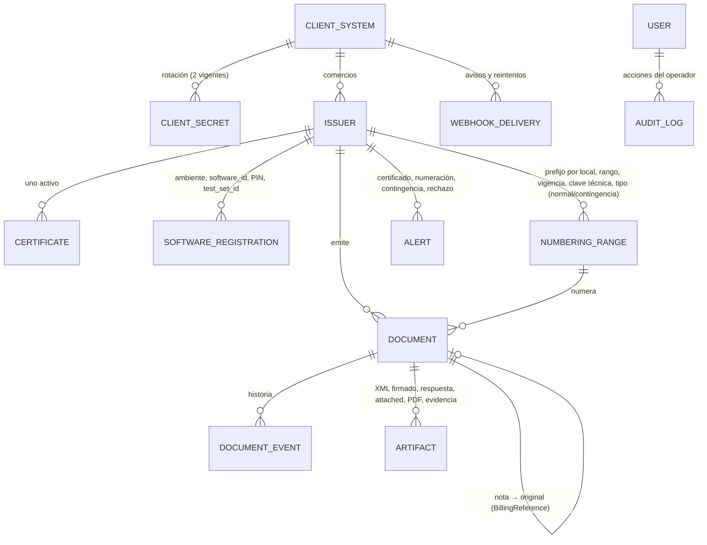
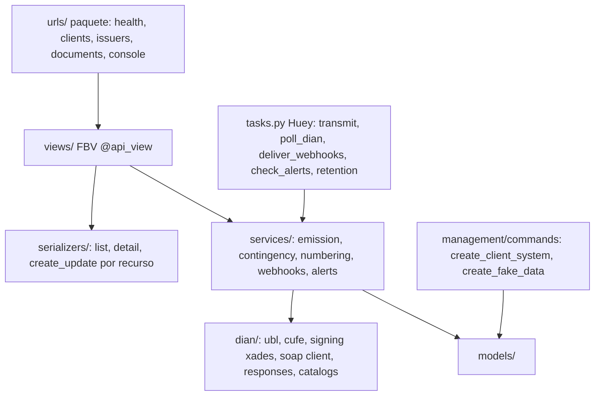

# Architecture — Fiscal.

> Memory Bank · actualizado 2026-10-04 (planeación técnica). **Diseño objetivo**: todavía no hay código de Fiscal.
> sobre la plantilla. Los nombres de apps, modelos y rutas son la propuesta; se confirman al implementar.

## Vista de sistema



- **Fiscal. no se publica en internet.** La API la alcanzan solo los sistemas cliente (red privada o lista de IP) y la
  consola de operación.
- **Dos autenticaciones:**
  - **HMAC por petición** para las máquinas (sistemas cliente): `X-Fiscal-Key`, `X-Fiscal-Timestamp` y
    `X-Fiscal-Signature`, con una ventana de 5 minutos.
  - **JWT de la plantilla** para las personas (operadores de ProjectApp).
- **La base es la fuente de verdad del estado de cada documento.** Huey solo ejecuta: una tarea periódica recoge lo
  pendiente, así que si Redis se pierde no se pierde ningún documento.
- `api/health/` responde `project` y `environment`, como en la plantilla, y además si la DIAN responde.

## Flujo de emisión normal



## Flujo de contingencia DIAN (tipo 04)

```mermaid
sequenceDiagram
    participant H as Huey
    participant D as DIAN
    participant W as Waiter
    H->>D: SendBillSync
    D--xH: 500/503/507/508/403 o demora > 1 min
    H->>D: reintentos (5 s ×3 ante error; cada 2 min ×5 ante demora)
    D--xH: sigue fallando
    H->>H: vuelve a firmar el MISMO número como InvoiceTypeCode=04; guarda ambos XML y la evidencia
    H->>W: aviso: contingency_dian + AttachedDocument sin ApplicationResponse (se entrega)
    loop cada 30 min
        H->>D: sondeo del servicio
    end
    H->>D: al volver, transmite el tipo 04 (plazo 48 h)
    H->>W: aviso: validated
```

## Flujo de contingencia del emisor (tipo 03, D5)

Se activa cuando **Waiter no tiene internet o Fiscal. no responde**:

1. **Waiter imprime una factura de contingencia** con el rango de contingencia autorizado al comercio por la DIAN y la
   guarda en su cola.
2. **Al volver la conexión, Waiter envía cada factura a Fiscal.** como `kind=invoice`, `contingency=issuer`, con la
   fecha y hora reales y el número del rango de contingencia.
3. **Fiscal. la transcribe como factura tipo 03** (CUDE con el PIN) y la transmite **dentro de las 48 h** siguientes a
   superar la falla.
4. **Avisos de plazo:** a las 24 h y a las 40 h, a Waiter (y a través de él al dueño del comercio) y a ProjectApp.
5. **La carta a la DIAN** (`contingencia.facturadorvp@dian.gov.co`) la firma el representante legal del comercio.
   Fiscal. la prepara con los datos del incidente; el envío lo confirma el dueño.

## Modelo de datos (propuesto)



- `ISSUER` se identifica por **NIT dentro de su `CLIENT_SYSTEM`**. Guarda tipo de persona, régimen, responsabilidades
  (catálogo DIAN), dirección con código DANE y nombre comercial.
- `DOCUMENT` es **inmutable** una vez construido: número, CUFE o CUDE y XML no cambian. Los estados son
  `queued`, `transmitting`, `validated`, `rejected`, `contingency_dian` y `contingency_issuer`. La unicidad va por
  emisor, prefijo y número, y por `idempotency_key` dentro del sistema cliente.
- `ARTIFACT` guarda hash SHA-256, tamaño, tipo y ubicación en el almacén. **No se borra antes de 10 años.**
- **Secretos cifrados con Fernet** (clave propia de Fiscal.): secretos de clientes, `.p12` y su contraseña, PIN del
  software y clave técnica de cada rango.

## Capas backend (convenciones de la plantilla)



- `dian/` es una **librería pura sin modelos**: recibe datos y devuelve XML, firma o respuesta interpretada. Se prueba
  con los vectores y ejemplos de los anexos, sin red.
- El acceso a la DIAN pasa por una interfaz (`DianGateway`) con dos implementaciones: SOAP real y simulada (desarrollo,
  e2e y CI). La simulada se niega a atender emisores en producción.
- Las apps siguen la plantilla: el nombre del proyecto Django y de la app se renombran al implementar (sección
  «Renombre» de `tasks/tasks_plan.md`).

## Frontend: consola de operación

- **Páginas:** inicio de sesión, tablero (documentos por estado, tasa de rechazo, latencia y salud de la DIAN),
  emisores (datos, certificado, rangos y alertas), detalle de documento (eventos, artefactos y reglas de rechazo en
  español), contingencias abiertas con su reloj de 48 h, sistemas cliente.
- Reutiliza de la plantilla: autenticación JWT, stores Zustand, axios con interceptores, next-intl (ES primero),
  Tailwind 4 y la marca Fiscal. (Ubuntu Bold).
- **El comercio no usa esta consola.** Su asistente de habilitación vive en la consola del dueño de Waiter.

## Integración con Waiter

Waiter cambia según `docs/fiscal/inventario/02-waiter.md` (sección 4):
- emitir al cobrar y fuera de la transacción que bloquea la organización;
- clave estable de idempotencia;
- datos y catálogos DIAN;
- canje de puntos como descuento;
- ruta de avisos firmada;
- factura de contingencia en el modo de emergencia (D5).

Ese trabajo es un plan en el repositorio de Waiter.

## Deployment / CI

- **Ahora: local (D6).** MySQL en el contenedor `fiscal-mysql` (127.0.0.1:3308), Redis local, Django en :8002, Huey y
  Next en :3002 (Waiter ya usa :3000). La transmisión a la DIAN de habilitación sale desde el equipo local con el
  certificado de ProjectApp (D3).
- **Después:** servidor propio con Gunicorn, Huey (systemd, como `scripts/systemd/` de la plantilla), respaldos
  cifrados fuera del servidor y NTP obligatorio.
- **CI:** el de la plantilla (pytest, Jest, Playwright, quality gate y coverage) más pruebas de `dian/` con los
  vectores de los anexos.
